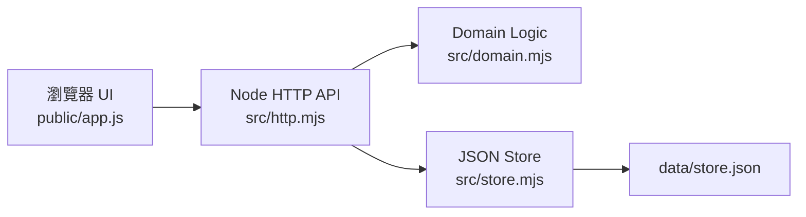

# MIS 代辦管理

本專案是一個本機執行的 MIS 待辦事項管理工具，用來追蹤多個 MIS 系統的待辦、期限、優先級與工程師指派狀態。

設計重點是符合嚴格內部資安環境：不使用外部 runtime 套件、不使用資料庫、不開放內網連線，資料以本機 JSON 檔保存。

## 功能

- 深色主題 Web 介面，包含 `待辦總覽`、`新增代辦`、`系統管理`、`工程師管理`、`設定`。
- 待辦總覽支援搜尋、系統篩選、狀態篩選、工程師篩選、期限篩選與排序。
- 待辦可設定系統、負責工程師、狀態、優先級、期限與備註。
- 狀態包含 `待處理`、`進行中`、`已完成`、`暫緩`、`取消`。
- `逾期` 不存成狀態，而是由期限與目前狀態即時計算。
- 總覽頁可勾選多筆待辦並批次變更狀態。
- 系統與工程師可新增、編輯、停用；停用後不再出現在新待辦選單。
- 待辦變更會記錄狀態、指派工程師、期限的歷程。
- 設定頁提供 JSON 匯出與匯入。

## 技術棧

- Node.js 內建 `http`、`fs/promises`、`crypto` 等模組
- 原生 HTML / CSS / JavaScript
- Node.js 內建測試框架 `node:test`
- 本機 JSON 檔案儲存
- 無外部 runtime dependencies

目前開發與驗證環境使用 Node.js `v22.15.0`。

## 快速開始

```powershell
npm start
```

啟動後開啟：

```text
http://127.0.0.1:4173
```

Server 固定綁定 `127.0.0.1`，不開放內網連線。

## 指令

| Command | Description |
| --- | --- |
| `npm start` | 啟動本機 Web server |
| `npm test` | 執行 Node.js 內建測試 |
| `npm run check` | 檢查 server、domain、store、API 與前端 JavaScript 語法 |

## 設定

| Variable | Description | Required |
| --- | --- | --- |
| `PORT` | 本機 server port，預設 `4173` | No |

Host 固定為 `127.0.0.1`，目前沒有提供設定為內網 host 的選項。

## 資料儲存

資料會自動建立在：

```text
data/store.json
```

資料檔包含：

- `systems`：MIS 系統清單
- `engineers`：可指派工程師清單
- `tasks`：待辦事項
- `history`：待辦狀態、指派工程師、期限的變更紀錄

寫入採用暫存檔再 rename 的方式，降低寫入中斷造成主資料檔損毀的風險。

`data/store.json` 已列入 `.gitignore`，避免把真實內部資料提交到版本控制。

## API

| Method | Path | Description |
| --- | --- | --- |
| `GET` | `/api/tasks` | 取得待辦與歷程 |
| `POST` | `/api/tasks` | 建立待辦 |
| `PUT` | `/api/tasks/:id` | 更新待辦 |
| `POST` | `/api/tasks/batch-status` | 批次更新待辦狀態 |
| `GET` | `/api/systems` | 取得系統清單 |
| `POST` | `/api/systems` | 建立系統 |
| `PUT` | `/api/systems/:id` | 更新系統 |
| `GET` | `/api/engineers` | 取得工程師清單 |
| `POST` | `/api/engineers` | 建立工程師 |
| `PUT` | `/api/engineers/:id` | 更新工程師 |
| `GET` | `/api/export` | 匯出完整 JSON 備份 |
| `POST` | `/api/import` | 匯入 JSON 並覆蓋目前資料 |

## 專案結構

```text
.
├── server.mjs          # 本機 server 入口，固定綁定 127.0.0.1
├── src/
│   ├── domain.mjs      # 資料模型、驗證、逾期判斷、歷程與批次更新邏輯
│   ├── http.mjs        # API routing 與靜態檔案服務
│   └── store.mjs       # JSON store 初始化、讀取、原子寫入
├── public/
│   ├── index.html      # 前端入口
│   ├── app.js          # 原生 JavaScript UI 與 API 呼叫
│   └── styles.css      # 深色主題與響應式版面
├── test/
│   └── domain.test.mjs # domain/store 測試
├── data/
│   └── .gitkeep        # 保留資料目錄；store.json 執行時產生
└── package.json
```

## 架構



## 測試範圍

目前測試涵蓋：

- JSON store 初始化、讀取與寫入
- 逾期判斷
- 待辦狀態、指派工程師、期限變更歷程
- 批次狀態更新
- 匯入資料的參照與狀態驗證

執行：

```powershell
npm test
```

## 備份與還原

在 `設定` 頁可以：

- 匯出目前完整資料為 JSON。
- 匯入 JSON 備份並覆蓋目前資料。

匯入前請先確認來源可信，因為目前匯入會取代整份本機資料。

## 已知限制

- 目前沒有登入、權限控管或多人併發處理。
- 目前沒有 Email、Teams、瀏覽器通知或排程提醒。
- 目前沒有外部資料庫、ORM 或 migration 機制。
- 目前只支援本機使用，不支援內網部署。

