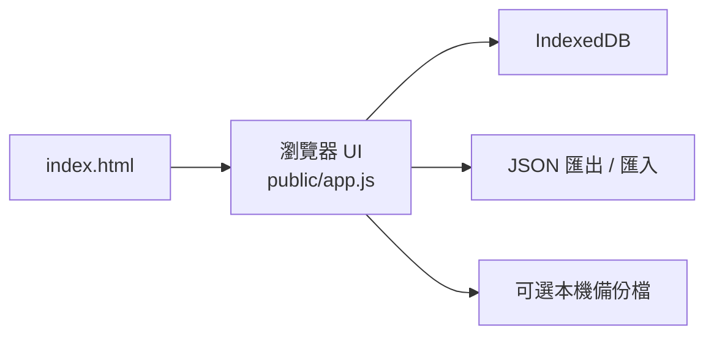

# MIS 代辦管理

這是一個可離線使用的 MIS 待辦事項管理工具，用來追蹤多個 MIS 系統的待辦、期限、優先級與工程師指派狀態。

目前設計目標是公司個人電腦沒有外網、不能安裝 npm 套件、不能開本機 server 時仍可使用。使用者只需要用瀏覽器直接開啟專案根目錄的 `index.html`。

## 功能

- 深色主題 Web 介面，包含 `待辦總覽`、`新增代辦`、`系統管理`、`工程師管理`、`設定`。
- 待辦總覽支援搜尋、系統篩選、狀態篩選、工程師篩選、期限篩選與排序。
- 待辦可設定系統、負責工程師、狀態、優先級、期限與備註。
- 狀態包含 `待處理`、`進行中`、`已完成`、`暫緩`、`取消`。
- `逾期` 不存成狀態，而是由期限與目前狀態即時計算。
- 總覽頁可勾選多筆待辦並批次變更狀態。
- 系統與工程師可新增、編輯、停用；停用後不再出現在新待辦選單。
- 待辦變更會記錄狀態、指派工程師、期限的歷程。
- 設定頁提供 JSON 匯出與匯入，方便備份或換電腦。

## 使用方式

不需要執行 npm、不需要 Node.js、不需要啟動 server。

1. 將整個專案資料夾複製到公司電腦。
2. 用瀏覽器開啟專案根目錄的 `index.html`。
3. 先到 `系統管理` 建立系統，再到 `工程師管理` 建立工程師。
4. 到 `新增代辦` 建立待辦事項。

如果只要發給使用者使用，至少需要保留：

```text
index.html
public/
  app.js
  styles.css
```

## 資料儲存

主要資料儲存在目前瀏覽器的 `IndexedDB`，不會連線、不會寫入 server，也不會寫入 `data/store.json`。

設定頁提供兩種備份方式：

- `匯出 JSON`：手動下載一份目前資料，可在資料遺失、換電腦或換瀏覽器後重新匯入。
- `本機備份檔`：若瀏覽器支援 File System Access API，可選擇一個 JSON 檔；之後每次資料變更都會自動覆寫該檔案。

注意事項：

- 同一台電腦換瀏覽器，資料不會自動共用。
- 清除瀏覽器網站資料可能會刪除待辦資料。
- 換電腦、重灌或交接前，請先到 `設定` 匯出 JSON 備份，或確認本機備份檔已更新。
- 匯入 JSON 會覆蓋目前瀏覽器內的資料。
- 瀏覽器不支援自動覆寫本機檔案時，仍可使用手動 JSON 匯出與匯入。

## 技術棧

- 原生 HTML / CSS / JavaScript
- 瀏覽器 `IndexedDB`
- JSON 檔案匯出 / 匯入
- 無外部 runtime dependencies
- 無 CDN、無 npm install、無資料庫

## 專案結構

```text
.
├── index.html          # 離線入口，直接用瀏覽器開啟
├── public/
│   ├── index.html      # 靜態目錄入口
│   ├── app.js          # 原生 JavaScript UI、IndexedDB 與本機備份資料層
│   └── styles.css      # 深色主題與響應式版面
├── src/                # 原本 Node 版 domain/store/http 程式，保留供開發測試參考
├── test/               # Node 測試
├── server.mjs          # 原本本機 server 入口，離線直接開檔模式不需要
└── package.json        # 開發檢查用，正式使用不需要執行
```

## 架構



## 開發檢查

正式使用不需要 npm。若開發電腦有 Node.js，可以執行：

```powershell
npm test
node --check public/app.js
```

## 已知限制

- 目前沒有登入、權限控管或多人併發處理。
- 資料綁定目前瀏覽器與目前檔案來源，請依賴 JSON 匯出或本機備份檔做備份。
- 目前沒有 Email、Teams、瀏覽器通知或排程提醒。
- 目前沒有外部資料庫、ORM 或 migration 機制。
